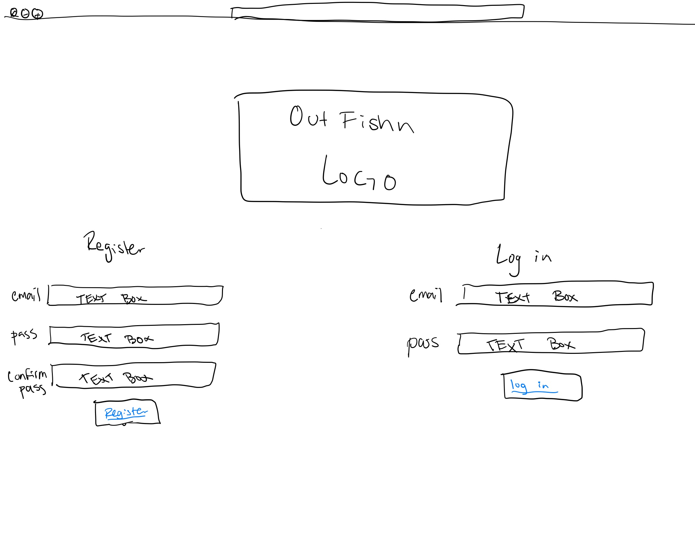
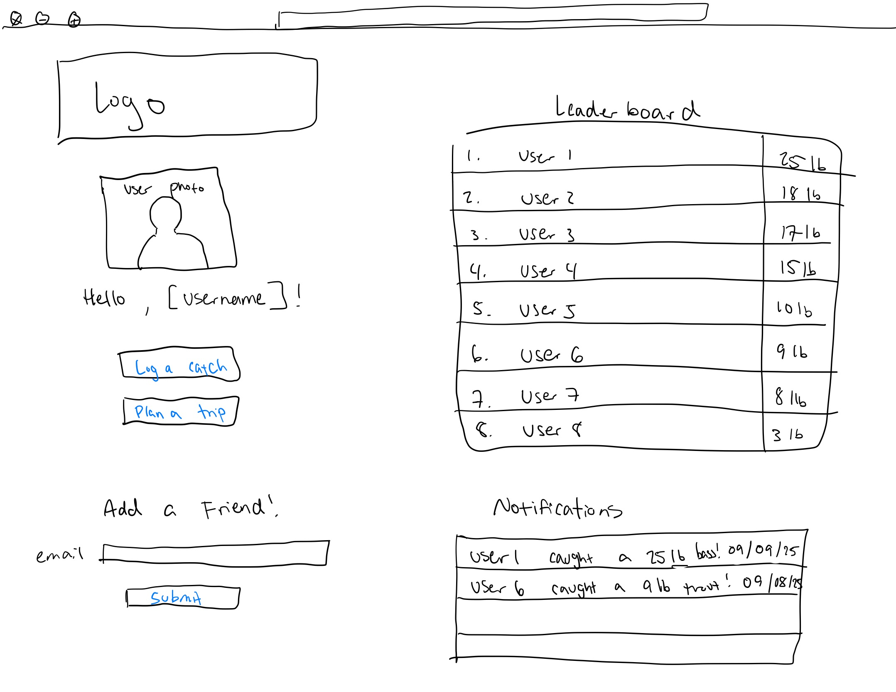
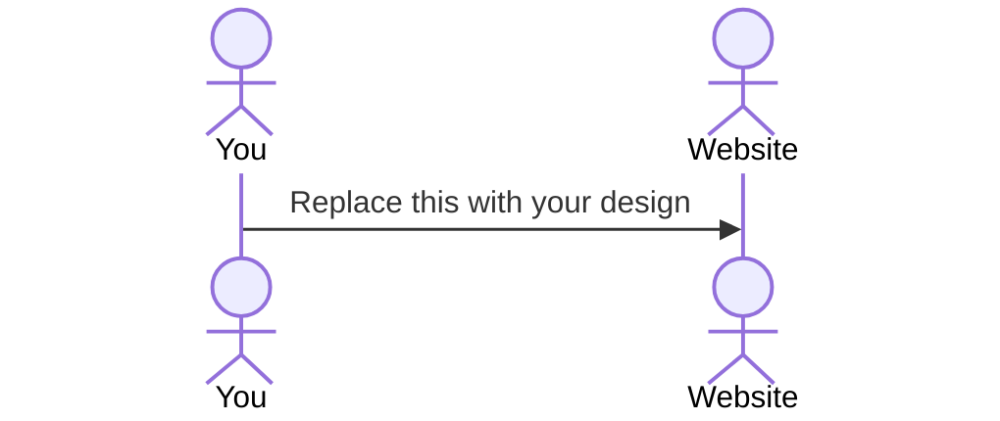

# OutFishn

[CS260 Lessons Learned](notes.md)

This file contains an organized breakdown of the lessons I learned related to Web Programming or the CS260 BYU course. This file may contain references to new files with additional information. Please reference these files as necessary.

Note: Not everything in this file will contain general programming information. Many of the notes may be specific to the "startup" project created in CS260.

Thank you.

## Specification Deliverable

### Elevator Pitch

Are you tired of sifting through Instagram pictures of cats, summer getaways, or whatever your friend had for lunch that day, eagerly looking for something to hook your attention? Let me introduce you to OutFishn, an angler's official social media replacement. Log your catches - show off that monster fish, get real-time alerts when a friend does the same, check the leaderboards, learn where to cast next, and much more! Create an account on OutFishn today and start reelin'.

### Key Features

* Register and login securely over HTTPS
* Log and persistenly store your catches (size, weight, time, location, bait, photo, etc.)
* Connect and share with your friends
* Get real-time alerts when a friend reels in a fish
* Race to the top of the leaderboards
* Get valuable input as to where you should cast next

### Technologies

I will use these avaliable technologies to complete the following:

- **HTML** - Uses correct HTML structure for application. There will be an HTML page for login, home page (includes leaderboard and alerts), a catch log page, and a trip planning page.
- **CSS** - Application styling that will adjust correctly for various screen sizes. Clean and minimalist design (includes strategic white space, logo, colors, and contrast).
- **React** - Provides registering, login, adding friends, logging fish, and leaderboard functionality. As well as use of React for routing and components.
- **Service** - Backend service with the following endpoints:
  - register
  - login
  - storing caught fish data
  - adding friends
  - plan trip
- **DB** - Stores registration and login authtokens to ensure user is logged in. Stores each user's catch history, friends, and fishing plans. Must be signed in to perform these actions.
- **WebSocket** - When a user logs a new fish, the catch will be broadcasted to each of their friends.

### Design Sketches

<u>Register/Login Page:</u>

<u>User Dashboard:</u>

<u>Log New Catch Page:</u>

## 🚀 HTML deliverable

For this deliverable I built out all of the general HTML structure of my web application. This inclues all of the following:

- [x] **HTML Pages** - Four HTML pages: Sign In/Register, Home, Fish Log, and a Trip Planner.
      
- [x] **Links** - The Sign In page contains a submit button for both the register and sign in feature. Clicking this button will transfer the user to their Home page. From the Home page, the user has the ability to select the two links listed below the user's profile picture and navigate to the Fish Log or Trip planning page. The user at any time may also decide to use the links in the header of each page to navigate between pages.
      
- [x] **Text** - Text is scattered around each page used as headers, table/database information, notifications, welcome statements, or as indicators for input fields.
      
- [x] **Images** - I used AI to help me create an appealing application logo with various formats. This logo is placed front and center on the sign in page as well as at the bottom of each page. A placeholder image is present for the user to eventually be able to update their profile picture. Finally, when a user logs a catch, they have the ability to submit a photo of the fish into the database.
      
- [x] **DB/Sign In** - Input box and submit button for register/sign in features. Input box and submit button for adding a friend. Various forms of input along with a final submission button for both logging a fish into the database, or submitting a plan for a new trip. Leaderboard database table is displayed on Home screen for users to see the competition. Fish Log database is visible on Fish Log page to allow the user to reflect on previous catches. Trips database is visible to the user on the Trip Planner page to keep track of planned trips.
      
- [x] **Websocket** - The current unorderd list on the Home page serves as a notification center. As users across the application reel in a new fish, add a friend, or plan a trip, a notofication will appear to others in real time.
      
- [x] **3rd Party Services** - As users add a new catch, they have the ability to utilize Leaflet.js APIs for determining the location of the catch. This 3rd party service allows users to scroll on a mini map and place a pin on the precise location of the catch. The exact coordinates of that pin will then be saved in the database with the other inforation gathered when the fish was caught. This will help users to further analyze popular fishing trends and understand where the most effective fishing locations are. The HTML placeholder for this appears as a simple box border on the Fish log page for this deliverable. Further Leaflet CSS and JS will be integrated in later deliverables.

## 🚀 CSS deliverable

For this deliverable I built out all of the CSS styling of my web application. This inclues all of the following:

- [x] **Header, footer, and main content body** - For this deliverable I made sure that across the entire application I had a consistent styling format for the header, footer, and main body. I locked the header and footer in place so that the user could easily access it from anywhere. The main body is clean, minimalist, but with a modern twist.
      
- [x] **Navigation elements** - In the header/footer there are consistant navigation elements such as links to the other pages or my GitHub repository. These are all styled consistently throughout. The main body has <a> tags that were styled to appear like modern buttons that change as the mouse hovers over it.
      
- [x] **Responsive to window resizing** - I carefully created a @media section in each of the pages to ensure that each page correctly and consistently resizes to the window size. At a window size less than 768px, the window should enter media mode and adjust its layout accordingly. I added x-scrolling features to my tables to make sure that data was not lost or cutoff when set to smaller screen sizes. 
      
- [x] **Application elements** - Each of the application elements were styled to be consistent with the overall application style. Image upload <input> tags were hidden but disguised as a label which was then styled to be a button. The notification center was styled to have several rows with a smaller text below each notification that indicates how long ago the notification arrived. Tables have an animation when the cursor hovers over them. Different forms of <input> tags are styled consistantly. The 3rd-party map box is styled consistant with the application.
      
- [x] **Application text content** - All text content was styled consistantly to have a font-family of Arial, sans-serif. All major headings/links have navy blue text color. Teal hover color is applied to all clickable features. Font sizes vary by location and purpose, but are consistant throughout pages.
      
- [x] **Application images** - Currently all image placeholders are styled consistantlt throughout the application. Profile picture has a modern circular border with a teal color. Fish pictures are more squared with slight radius in the corners. They also have the teal border. Images within tables remain as placeholders. Logos throughout the application are adaptable to the size of screen. Background logo added to all main pages of the application to add depth.

## 🚀 React part 1: Routing deliverable

For this deliverable I ported my application to React. This inclues all of the following:

- [x] **Bundled using Vite** - I insatlled Vite, React, and Bootsrap. I also changed the overall structure of my project to fit what Vite expects. This includes creating `public` and `src` folders. Within the `src` folder, we have our `app.jsx` and `app.cs` files, along with a folder that contains the `.jsx` and `.css` files for each of the following pages used in the application.

- [x] **Components** - I sucessfully divided up the application into different components. Within the `app.jsx` file, we have a main app compnent that delegates the entire app. We then have a sub-component that allows me to create a background image for the subsequent pages. Within each of the directories for the following pages, we have main page components that dictate the `<main>` structure of the page. The `<header> and <footer>` is outlined within the `app.jsx` file's app component.

- [x] **Router** - Within the `app.jsx` file, we have a main app component that drives the rest of the appication. This component also contains working routes for each of the other pages. When these pages are called by the user, the router then reaches the specific route desired and brings up the corresponding page. These routes are mainly used within the header of the pages, however in the home page, the routes are also used if the user selects the "Fish Log" or "Plan a Trip" button.

## 🚀 React part 2: Reactivity deliverable

For this deliverable I created full functionality and MOCK functionality for different aspects of the Web App. I checked the box `[x]` and added a description for things I completed.

- [x] **All functionality implemented or mocked out** - I completed this deliverable by using React state and props for reactivity. All backend interactions (user management, logging catches, planning trips, friend requests, and leaderboard ranking) were mocked using the browser's `localStorage` API to ensure data persistence across sessions without a database. New data (like logged fish and planned trips) dynamically updates the UI upon submission.

- [x] **Hooks** - I completed this deliverable by utilizing several essential React Hooks across the application:

* `useState` was used for managing all local component data, including form inputs (e.g., email, password) and dynamic content (e.g., notifications, profile picture).

* `useEffect` was used for two primary purposes: managing side effects like setting the page title (`document.title`), and syncing local component state (like the `allCatches` and `trips` arrays) with `localStorage` for mocking data persistence.

* `useCallback` was used to create the `handleNewCatch` function, preventing unnecessary re-creation and ensuring function identity remains stable when passed down to its children.

* `useNavigate` and `useLocation` were used to manage the application's routing, enabling immediate page redirection after successful authentication and updating the header based on the current page.

---

## 🚀 Specification Deliverable

> [!NOTE]
>  Fill in this sections as the submission artifact for this deliverable. You can refer to this [example](https://github.com/webprogramming260/startup-example/blob/main/README.md) for inspiration.

For this deliverable I did the following. I checked the box `[x]` and added a description for things I completed.

- [ ] Proper use of Markdown
- [ ] A concise and compelling elevator pitch
- [ ] Description of key features
- [ ] Description of how you will use each technology
- [ ] One or more rough sketches of your application. Images must be embedded in this file using Markdown image references.

### Design

Lorem ipsum dolor sit amet, consectetur adipiscing elit, sed do eiusmod tempor incididunt ut labore et dolore magna aliqua. Ut enim ad minim veniam, quis nostrud exercitation ullamco laboris nisi ut aliquip ex ea commodo consequat. Duis aute irure dolor in reprehenderit in voluptate velit esse cillum dolore eu fugiat nulla pariatur. Excepteur sint occaecat cupidatat non proident, sunt in culpa qui officia deserunt mollit anim id est laborum.

## 🚀 AWS deliverable

For this deliverable I did the following. I checked the box `[x]` and added a description for things I completed.

- [ ] **Server deployed and accessible with custom domain name** - [My server link](https://yourdomainnamehere.click).

## 🚀 Service deliverable

For this deliverable I did the following. I checked the box `[x]` and added a description for things I completed.

- [ ] **Node.js/Express HTTP service** - I did not complete this part of the deliverable.
- [ ] **Static middleware for frontend** - I did not complete this part of the deliverable.
- [ ] **Calls to third party endpoints** - I did not complete this part of the deliverable.
- [ ] **Backend service endpoints** - I did not complete this part of the deliverable.
- [ ] **Frontend calls service endpoints** - I did not complete this part of the deliverable.
- [ ] **Supports registration, login, logout, and restricted endpoint** - I did not complete this part of the deliverable.

## 🚀 DB deliverable

For this deliverable I did the following. I checked the box `[x]` and added a description for things I completed.

- [ ] **Stores data in MongoDB** - I did not complete this part of the deliverable.
- [ ] **Stores credentials in MongoDB** - I did not complete this part of the deliverable.

## 🚀 WebSocket deliverable

For this deliverable I did the following. I checked the box `[x]` and added a description for things I completed.

- [ ] **Backend listens for WebSocket connection** - I did not complete this part of the deliverable.
- [ ] **Frontend makes WebSocket connection** - I did not complete this part of the deliverable.
- [ ] **Data sent over WebSocket connection** - I did not complete this part of the deliverable.
- [ ] **WebSocket data displayed** - I did not complete this part of the deliverable.
- [ ] **Application is fully functional** - I did not complete this part of the deliverable.
