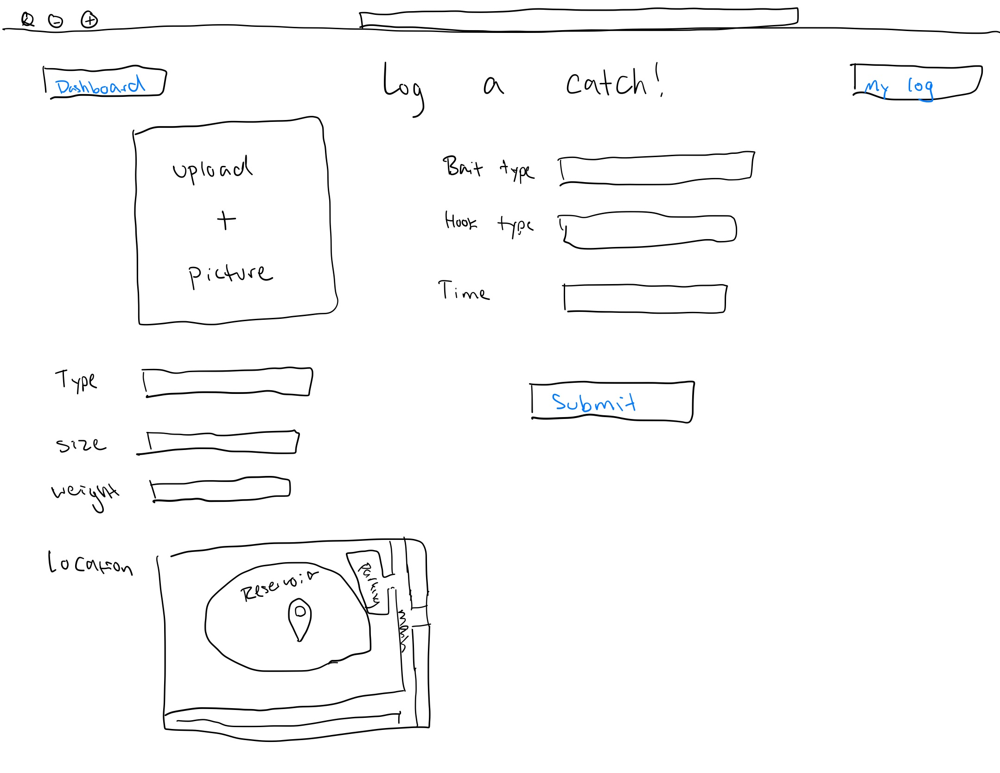

# OutFishn

[CS260 Lessons Learned](notes.md)

This file contains an organized breakdown of the lessons I learned related to Web Programming or the CS260 BYU course. This file may contain references to new files with additional information. Please reference these files as necessary.

Note: Not everything in this file will contain general programming information. Many of the notes may be specific to the "startup" project created in CS260.

Thank you.

## Specification Deliverable

### Elevator Pitch

Are you tired of sifting through Instagram pictures of cats, summer getaways, or whatever your friend had for lunch that day, eagerly looking for something to hook your attention? Let me introduce you to OutFishn, an angler's official social media replacement. Log your catches - show off that monster fish, get real-time alerts when a friend does the same, check the leaderboards, learn where to cast next, and much more! Create an account on OutFishn today and start reelin'.

### Key Features

* Register and login securely over HTTPS
* Log and persistenly store your catches (size, weight, time, location, bait, photo, etc.)
* Connect and share with your friends
* Get real-time alerts when a friend reels in a fish
* Race to the top of the leaderboards
* Get valuable input as to where you should cast next

### Technologies

I will use these avaliable technologies to complete the following:

- **HTML** - Uses correct HTML structure for application. There will be an HTML page for login, home page (includes leaderboard and alerts), a catch log page, and a trip planning page.
- **CSS** - Application styling that will adjust correctly for various screen sizes. Clean and minimalist design (includes strategic white space, logo, colors, and contrast).
- **React** - Provides registering, login, adding friends, logging fish, and leaderboard functionality. As well as use of React for routing and components.
- **Service** - Backend service with the following endpoints:
  - register
  - login
  - storing caught fish data
  - adding friends
  - plan trip
- **DB** - Stores registration and login authtokens to ensure user is logged in. Stores each user's catch history, friends, and fishing plans. Must be signed in to perform these actions.
- **WebSocket** - When a user logs a new fish, the catch will be broadcasted to each of their friends.

## HTML Deliverable

For this deliverable I built out all of the general HTML structure of my web application. This inclues all of the following:

- [x] **HTML Pages*** - Four HTML pages: Sign In/Register, Home, Fish Log, and a Trip Planner.
- [x] **Links** - The Sign In page contains a submit button for both the register and sign in feature. Clicking this button will transfer the user to their Home page. From the Home page, the user has the ability to select the two links listed below the user's profile picture and navigate to the Fish Log or Trip planning page. The user at any time may also decide to use the links in the header of each page to navigate between pages.
- [x] **Text** - Text is scattered around each page used as headers, table/database information, notifications, welcome statements, or as indicators for input fields.
- [x] **Images** - I used AI to help me create an appealing application logo with various formats. This logo is placed front and center on the sign in page as well as at the bottom of each page. A placeholder image is present for the user to eventually be able to update their profile picture. Finally, when a user logs a catch, they have the ability to submit a photo of the fish into the database.
- [x] **DB/Sign In** - Input box and submit button for register/sign in features. Input box and submit button for adding a friend. Various forms of input along with a final submission button for both logging a fish into the database, or submitting a plan for a new trip. Leaderboard database table is displayed on Home screen for users to see the competition. Fish Log database is visible on Fish Log page to allow the user to reflect on previous catches. Trips database is visible to the user on the Trip Planner page to keep track of planned trips.
- [x] **Websocket** - The current unorderd list on the Home page serves as a notification center. As users across the application reel in a new fish, add a friend, or plan a trip, a notofication will appear to others in real time.
- [x] **3rd Party Services** - As users add a new catch, they have the ability to utilize Leaflet.js APIs for determining the location of the catch. This 3rd party service allows users to scroll on a mini map and place a pin on the precise location of the catch. The exact coordinates of that pin will then be saved in the database with the other inforation gathered when the fish was caught. This will help users to further analyze popular fishing trends and understand where the most effective fishing locations are. The HTML placeholder for this appears as a simple box border on the Fish log page for this deliverable. Further Leaflet CSS and JS will be integrated in later deliverables. 

---

### Design Sketches

<u>Register/Login Page:</u>

<u>User Dashboard:</u>

<u>Log New Catch Page:</u>

> [!NOTE]
>  This is a template for your startup application. You must modify this `README.md` file for each phase of your development. You only need to fill in the section for each deliverable when that deliverable is submitted in Canvas. Without completing the section for a deliverable, the TA will not know what to look for when grading your submission. Feel free to add additional information to each deliverable description, but make sure you at least have the list of rubric items and a description of what you did for each item.

> [!NOTE]
>  If you are not familiar with Markdown then you should review the [documentation](https://docs.github.com/en/get-started/writing-on-github/getting-started-with-writing-and-formatting-on-github/basic-writing-and-formatting-syntax) before continuing.

## 🚀 Specification Deliverable

> [!NOTE]
>  Fill in this sections as the submission artifact for this deliverable. You can refer to this [example](https://github.com/webprogramming260/startup-example/blob/main/README.md) for inspiration.

For this deliverable I did the following. I checked the box `[x]` and added a description for things I completed.

- [ ] Proper use of Markdown
- [ ] A concise and compelling elevator pitch
- [ ] Description of key features
- [ ] Description of how you will use each technology
- [ ] One or more rough sketches of your application. Images must be embedded in this file using Markdown image references.

### Elevator pitch

Lorem ipsum dolor sit amet, consectetur adipiscing elit, sed do eiusmod tempor incididunt ut labore et dolore magna aliqua. Ut enim ad minim veniam, quis nostrud exercitation ullamco laboris nisi ut aliquip ex ea commodo consequat. Duis aute irure dolor in reprehenderit in voluptate velit esse cillum dolore eu fugiat nulla pariatur. Excepteur sint occaecat cupidatat non proident, sunt in culpa qui officia deserunt mollit anim id est laborum.

### Design

Lorem ipsum dolor sit amet, consectetur adipiscing elit, sed do eiusmod tempor incididunt ut labore et dolore magna aliqua. Ut enim ad minim veniam, quis nostrud exercitation ullamco laboris nisi ut aliquip ex ea commodo consequat. Duis aute irure dolor in reprehenderit in voluptate velit esse cillum dolore eu fugiat nulla pariatur. Excepteur sint occaecat cupidatat non proident, sunt in culpa qui officia deserunt mollit anim id est laborum.

### Key features

- Describe your key feature
- Describe your key feature
- Describe your key feature

### Technologies

I am going to use the required technologies in the following ways.

- **HTML** - Description here
- **CSS** - Description here
- **React** - Description here
- **Service** - Description here
- **DB/Login** - Description here
- **WebSocket** - Description here

## 🚀 AWS deliverable

For this deliverable I did the following. I checked the box `[x]` and added a description for things I completed.

- [ ] **Server deployed and accessible with custom domain name** - [My server link](https://yourdomainnamehere.click).

## 🚀 HTML deliverable

For this deliverable I did the following. I checked the box `[x]` and added a description for things I completed.

- [ ] **HTML pages** - I did not complete this part of the deliverable.
- [ ] **Proper HTML element usage** - I did not complete this part of the deliverable.
- [ ] **Links** - I did not complete this part of the deliverable.
- [ ] **Text** - I did not complete this part of the deliverable.
- [ ] **3rd party API placeholder** - I did not complete this part of the deliverable.
- [ ] **Images** - I did not complete this part of the deliverable.
- [ ] **Login placeholder** - I did not complete this part of the deliverable.
- [ ] **DB data placeholder** - I did not complete this part of the deliverable.
- [ ] **WebSocket placeholder** - I did not complete this part of the deliverable.

## 🚀 CSS deliverable

For this deliverable I did the following. I checked the box `[x]` and added a description for things I completed.

- [ ] **Header, footer, and main content body** - I did not complete this part of the deliverable.
- [ ] **Navigation elements** - I did not complete this part of the deliverable.
- [ ] **Responsive to window resizing** - I did not complete this part of the deliverable.
- [ ] **Application elements** - I did not complete this part of the deliverable.
- [ ] **Application text content** - I did not complete this part of the deliverable.
- [ ] **Application images** - I did not complete this part of the deliverable.

## 🚀 React part 1: Routing deliverable

For this deliverable I did the following. I checked the box `[x]` and added a description for things I completed.

- [ ] **Bundled using Vite** - I did not complete this part of the deliverable.
- [ ] **Components** - I did not complete this part of the deliverable.
- [ ] **Router** - I did not complete this part of the deliverable.

## 🚀 React part 2: Reactivity deliverable

For this deliverable I did the following. I checked the box `[x]` and added a description for things I completed.

- [ ] **All functionality implemented or mocked out** - I did not complete this part of the deliverable.
- [ ] **Hooks** - I did not complete this part of the deliverable.

## 🚀 Service deliverable

For this deliverable I did the following. I checked the box `[x]` and added a description for things I completed.

- [ ] **Node.js/Express HTTP service** - I did not complete this part of the deliverable.
- [ ] **Static middleware for frontend** - I did not complete this part of the deliverable.
- [ ] **Calls to third party endpoints** - I did not complete this part of the deliverable.
- [ ] **Backend service endpoints** - I did not complete this part of the deliverable.
- [ ] **Frontend calls service endpoints** - I did not complete this part of the deliverable.
- [ ] **Supports registration, login, logout, and restricted endpoint** - I did not complete this part of the deliverable.

## 🚀 DB deliverable

For this deliverable I did the following. I checked the box `[x]` and added a description for things I completed.

- [ ] **Stores data in MongoDB** - I did not complete this part of the deliverable.
- [ ] **Stores credentials in MongoDB** - I did not complete this part of the deliverable.

## 🚀 WebSocket deliverable

For this deliverable I did the following. I checked the box `[x]` and added a description for things I completed.

- [ ] **Backend listens for WebSocket connection** - I did not complete this part of the deliverable.
- [ ] **Frontend makes WebSocket connection** - I did not complete this part of the deliverable.
- [ ] **Data sent over WebSocket connection** - I did not complete this part of the deliverable.
- [ ] **WebSocket data displayed** - I did not complete this part of the deliverable.
- [ ] **Application is fully functional** - I did not complete this part of the deliverable.
